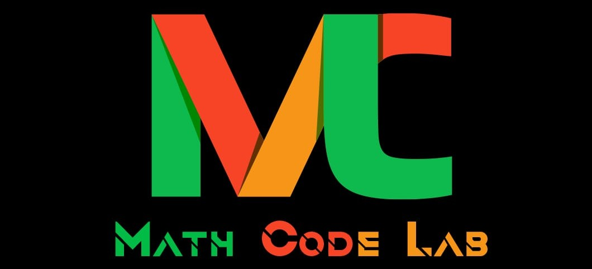

<div style="text-align: center;">
  
</div>

# 🔢 Practice: Numeric Lists

## 🎯 Learning Objectives
By completing these exercises, you will:
- Master working with numeric lists (integers and floats)
- Implement mathematical operations on lists
- Develop algorithmic thinking for numeric data
- Learn to solve real-world math problems with lists

---

## 📋 Instructions
- Write your own code without using built-in functions (unless specified)
- Use loops and conditional statements to solve each problem
- Test your code with different test cases
- Think about edge cases (empty lists, single element, negative numbers)

---

## 🔢 Basic Numeric Operations

### 1️⃣ Sum of Numbers in a List
Write a Python program to find the sum of all numbers in a list **without using `sum()`**.

**Example with Code:**
```python
numbers = [10, 20, 30, 40, 50]

# Start with total = 0
total = 0

# Add each number one by one
for num in numbers:
    total = total + num

print("Sum:", total)  # Output: 150
```

**How it works:**
```
Step 1: total = 0
Step 2: Add 10 → total = 0 + 10 = 10
Step 3: Add 20 → total = 10 + 20 = 30
Step 4: Add 30 → total = 30 + 30 = 60
Step 5: Add 40 → total = 60 + 40 = 100
Step 6: Add 50 → total = 100 + 50 = 150
Result: 150
```

**Visual Representation:**
```
[10, 20, 30, 40, 50]
  ↓   ↓   ↓   ↓   ↓
 10 + 20 + 30 + 40 + 50 = 150
```

**Now You Try:**
```python
# Practice with these lists:
scores = [85, 92, 78, 95, 88]
prices = [19.99, 24.50, 12.75, 8.99]
# Calculate the sum for each list
```

---

### 2️⃣ Find the Average
Calculate the average of all numbers **without using `sum()` or `len()`**.

**Example with Code:**
```python
scores = [85, 92, 78, 95, 88]

# Step 1: Add all numbers
total = 0
for score in scores:
    total = total + score

# Step 2: Count how many numbers
count = 0
for score in scores:
    count = count + 1

# Step 3: Calculate average
average = total / count

print("Total:", total)      # Output: 438
print("Count:", count)      # Output: 5
print("Average:", average)  # Output: 87.6
```

**How it works:**
```
First Loop - Calculate Total:
  0 + 85 = 85
  85 + 92 = 177
  177 + 78 = 255
  255 + 95 = 350
  350 + 88 = 438

Second Loop - Count Items:
  Start: 0
  Count each: 1, 2, 3, 4, 5

Calculate Average:
  438 ÷ 5 = 87.6
```

**More Efficient Version (one loop):**
```python
scores = [85, 92, 78, 95, 88]

total = 0
count = 0

# Do both in one loop!
for score in scores:
    total = total + score
    count = count + 1

average = total / count
print("Average:", average)  # Output: 87.6
```

**Now You Try:**
```python
# Practice with these:
temperatures = [72, 75, 68, 80, 77]
prices = [19.99, 24.50, 12.75]
# Calculate average for each
```

---

### 3️⃣ Product of All Numbers
Write a program to find the product of all numbers in a list (multiply them all together).

**Example:**
```python
numbers = [2, 3, 4, 5]
# Expected output: 120 (because 2 × 3 × 4 × 5 = 120)
```

💡 **Hint:** Start with `product = 1` and multiply each number inside a loop.

**Your Solution:**
```python
# Write your code here
```

---

## 🔍 Finding Extremes (Min/Max)

### 4️⃣ Minimum Number in a List
Write a program to find the smallest number in a list **without using `min()`**.

**Example with Code:**
```python
numbers = [45, 12, 78, 23, 9, 56]

# Start by assuming first number is the smallest
minimum = numbers[0]

# Check each number
for num in numbers:
    if num < minimum:
        minimum = num

print("Minimum:", minimum)  # Output: 9
```

**How it works:**
```
Start: minimum = 45 (first number)

Check 45: Is 45 < 45? No, keep minimum = 45
Check 12: Is 12 < 45? Yes! Update minimum = 12
Check 78: Is 78 < 12? No, keep minimum = 12
Check 23: Is 23 < 12? No, keep minimum = 12
Check 9:  Is 9 < 12? Yes! Update minimum = 9
Check 56: Is 56 < 9? No, keep minimum = 9

Result: 9 is the smallest
```

**Visual Trace:**
```
[45, 12, 78, 23, 9, 56]
 ↓
min=45 → 12 is smaller → min=12
                          ↓
                     9 is smaller → min=9 ✓
```

**Now You Try:**
```python
# Practice with these:
temperatures = [-5, 10, -15, 20, 0]  # Try with negatives!
scores = [88, 92, 75, 95, 82]
# Find the minimum for each
```

---

### 5️⃣ Maximum Number in a List
Write a program to find the largest number in a list **without using `max()`**.

**Example with Code:**
```python
numbers = [45, 12, 78, 23, 9, 56]

# Start by assuming first number is the largest
maximum = numbers[0]

# Check each number
for num in numbers:
    if num > maximum:
        maximum = num

print("Maximum:", maximum)  # Output: 78
```

**How it works:**
```
Start: maximum = 45 (first number)

Check 45: Is 45 > 45? No, keep maximum = 45
Check 12: Is 12 > 45? No, keep maximum = 45
Check 78: Is 78 > 45? Yes! Update maximum = 78
Check 23: Is 23 > 78? No, keep maximum = 78
Check 9:  Is 9 > 78? No, keep maximum = 78
Check 56: Is 56 > 78? No, keep maximum = 78

Result: 78 is the largest
```

**Visual Trace:**
```
[45, 12, 78, 23, 9, 56]
 ↓       ↓
max=45 → 78 is bigger → max=78 ✓ (remains largest)
```

**Now You Try:**
```python
# Practice with these:
heights = [165, 178, 152, 188, 170]  # in cm
scores = [95, 88, 92, 87, 91]
# Find the maximum for each
```

---

### 6️⃣ Find Both Min and Max in One Loop
Write a program to find both smallest and largest numbers in a list using a **single loop**.

**Example:**
```python
numbers = [45, 12, 78, 23, 9, 56]
# Expected output: Smallest: 9, Largest: 78
```

💡 **Hint:** Initialize both variables with the first element, then update both in the same loop.

**Your Solution:**
```python
# Write your code here
```

---

### 7️⃣ Find the Difference Between Largest and Smallest
Write a program to find the difference between the largest and smallest number **without using `max()` or `min()`**.

**Example:**
```python
numbers = [45, 12, 78, 23, 9, 56]
# Expected output: 69 (78 - 9)
```

💡 **Hint:** First find both manually using loops, then subtract them.

**Your Solution:**
```python
# Write your code here
```

---

### 8️⃣ Find Second Largest Number
Write a program to find the second largest number in a list **without using `sort()` or `max()`**.

**Example:**
```python
numbers = [45, 12, 78, 23, 56, 89]
# Expected output: 78 (second largest after 89)
```

💡 **Hint:** Use two variables — one for largest and one for second largest. Update while looping.

**Your Solution:**
```python
# Write your code here
```

---

## 📊 Counting and Filtering

### 9️⃣ Count Even and Odd Numbers
Write a program to count how many numbers in a list are even and how many are odd.

**Example with Code:**
```python
numbers = [1, 2, 3, 4, 5, 6, 7, 8, 9, 10]

# Start counters at 0
even_count = 0
odd_count = 0

# Check each number
for num in numbers:
    if num % 2 == 0:
        # Number is even
        even_count = even_count + 1
    else:
        # Number is odd
        odd_count = odd_count + 1

print("Even:", even_count)  # Output: 5
print("Odd:", odd_count)    # Output: 5
```

**How it works:**
```
The % operator gives the remainder when dividing:
  2 % 2 = 0 (even - no remainder)
  3 % 2 = 1 (odd - remainder of 1)
  4 % 2 = 0 (even)
  5 % 2 = 1 (odd)

Checking each number:
1 % 2 = 1 (odd) → odd_count = 1
2 % 2 = 0 (even) → even_count = 1
3 % 2 = 1 (odd) → odd_count = 2
4 % 2 = 0 (even) → even_count = 2
5 % 2 = 1 (odd) → odd_count = 3
6 % 2 = 0 (even) → even_count = 3
7 % 2 = 1 (odd) → odd_count = 4
8 % 2 = 0 (even) → even_count = 4
9 % 2 = 1 (odd) → odd_count = 5
10 % 2 = 0 (even) → even_count = 5

Result: Even: 5, Odd: 5
```

**Now You Try:**
```python
# Practice with these:
ages = [12, 15, 18, 21, 25, 30]
test_numbers = [11, 22, 33, 44, 55, 66]
# Count even and odd in each list
```

---

### 🔟 Count Positive and Negative Numbers
Write a program to count how many numbers are positive and how many are negative.

**Example:**
```python
numbers = [10, -5, 20, -15, 0, 30, -8]
# Expected output: Positive: 3, Negative: 3, Zero: 1
```

💡 **Hint:** Check with `if num > 0`, `if num < 0`, and `if num == 0`.

**Your Solution:**
```python
# Write your code here
```

---

### 1️⃣1️⃣ Count Numbers Greater Than a Value
Ask the user for a number `x` and count how many numbers in the list are greater than `x`.

**Example:**
```python
numbers = [10, 25, 30, 15, 40, 5]
x = 20
# Expected output: 3 numbers are greater than 20
```

💡 **Hint:** Use a counter and increment it each time you find a number greater than x.

**Your Solution:**
```python
# Write your code here
```

---

### 1️⃣2️⃣ Find All Numbers in a Range
Write a program to find all numbers that fall between two values (inclusive).

**Example:**
```python
numbers = [5, 15, 25, 35, 45, 55, 65]
min_val = 20
max_val = 50
# Expected output: [25, 35, 45]
```

💡 **Hint:** Use `if min_val <= num <= max_val`.

**Your Solution:**
```python
# Write your code here
```

---

## 🔄 List Transformations

### 1️⃣3️⃣ Double Every Number
Create a new list where each number is doubled.

**Example:**
```python
original = [1, 2, 3, 4, 5]
# Expected output: [2, 4, 6, 8, 10]
```

💡 **Hint:** Create an empty list and append `num * 2` for each number.

**Your Solution:**
```python
# Write your code here
```

---

### 1️⃣4️⃣ Square Each Number
Create a new list with the square of each number.

**Example:**
```python
numbers = [1, 2, 3, 4, 5]
# Expected output: [1, 4, 9, 16, 25]
```

💡 **Hint:** Use `num ** 2` or `num * num` to square a number.

**Your Solution:**
```python
# Write your code here
```

---

### 1️⃣5️⃣ Filter Even Numbers Only
Create a new list containing only even numbers from the original list.

**Example with Code:**
```python
numbers = [1, 2, 3, 4, 5, 6, 7, 8, 9, 10]

# Create empty list for even numbers
even_numbers = []

# Check each number
for num in numbers:
    if num % 2 == 0:
        # It's even, add it to the list
        even_numbers.append(num)

print("Original:", numbers)
print("Even only:", even_numbers)  # Output: [2, 4, 6, 8, 10]
```

**How it works:**
```
Start with: even_numbers = []

Check 1: 1 % 2 = 1 (odd), skip
Check 2: 2 % 2 = 0 (even), add → [2]
Check 3: 3 % 2 = 1 (odd), skip
Check 4: 4 % 2 = 0 (even), add → [2, 4]
Check 5: 5 % 2 = 1 (odd), skip
Check 6: 6 % 2 = 0 (even), add → [2, 4, 6]
Check 7: 7 % 2 = 1 (odd), skip
Check 8: 8 % 2 = 0 (even), add → [2, 4, 6, 8]
Check 9: 9 % 2 = 1 (odd), skip
Check 10: 10 % 2 = 0 (even), add → [2, 4, 6, 8, 10]

Result: [2, 4, 6, 8, 10]
```

**Visual Filtering:**
```
[1, 2, 3, 4, 5, 6, 7, 8, 9, 10]
 ✗  ✓  ✗  ✓  ✗  ✓  ✗  ✓  ✗  ✓
    ↓     ↓     ↓     ↓     ↓
   [2,   4,    6,    8,   10]
```

**Now You Try:**
```python
# Practice with these:
mixed = [15, 20, 33, 42, 57, 68, 71, 84]
# Filter to get only even numbers

# Challenge: Create a filter for odd numbers instead!
```

---

### 1️⃣6️⃣ Reverse a List
Write a program to reverse a list **without using `reverse()` or slicing (`[::-1]`)**.

**Example with Code:**
```python
numbers = [1, 2, 3, 4, 5]

# Method 1: Using negative indexes
reversed_list = []

# Count how many items
count = 0
for num in numbers:
    count = count + 1

# Add items from end to beginning
for i in range(1, count + 1):
    reversed_list.append(numbers[-i])

print("Original:", numbers)
print("Reversed:", reversed_list)  # Output: [5, 4, 3, 2, 1]
```

**How it works:**
```
Original list: [1, 2, 3, 4, 5]
Indexes:        0  1  2  3  4
Negative:      -5 -4 -3 -2 -1

Using negative indexes:
  numbers[-1] = 5 → add to reversed_list → [5]
  numbers[-2] = 4 → add to reversed_list → [5, 4]
  numbers[-3] = 3 → add to reversed_list → [5, 4, 3]
  numbers[-4] = 2 → add to reversed_list → [5, 4, 3, 2]
  numbers[-5] = 1 → add to reversed_list → [5, 4, 3, 2, 1]
```

**Alternative Method:**
```python
numbers = [1, 2, 3, 4, 5]
reversed_list = []

# Find length
length = 0
for num in numbers:
    length = length + 1

# Build reversed list using positive indexes
for i in range(length - 1, -1, -1):
    reversed_list.append(numbers[i])

print("Reversed:", reversed_list)  # Output: [5, 4, 3, 2, 1]
```

**How range(4, -1, -1) works:**
```
range(4, -1, -1) generates: 4, 3, 2, 1, 0
So we access:
  numbers[4] = 5
  numbers[3] = 4
  numbers[2] = 3
  numbers[1] = 2
  numbers[0] = 1
Result: [5, 4, 3, 2, 1]
```

**Now You Try:**
```python
# Practice with these:
ages = [10, 12, 15, 18, 20]
scores = [85, 90, 75, 95]
# Reverse each list
```

---

## 🎯 Advanced Challenges

### 1️⃣7️⃣ Find Numbers Divisible by Both 3 and 5
Find all numbers that are divisible by both 3 AND 5.

**Example:**
```python
numbers = [15, 20, 30, 45, 50, 60, 75]
# Expected output: [15, 30, 45, 60, 75]
```

💡 **Hint:** Use `if num % 3 == 0 and num % 5 == 0`.

**Your Solution:**
```python
# Write your code here
```

---

### 1️⃣8️⃣ Calculate Running Total
Create a list showing the running total at each position.

**Example:**
```python
numbers = [1, 2, 3, 4, 5]
# Expected output: [1, 3, 6, 10, 15]
# (1, 1+2=3, 1+2+3=6, 1+2+3+4=10, 1+2+3+4+5=15)
```

💡 **Hint:** Keep a running sum and append it at each step.

**Your Solution:**
```python
# Write your code here
```

---

### 1️⃣9️⃣ Find Missing Number in Sequence
Given a list of numbers from 1 to n with one missing, find the missing number.

**Example:**
```python
numbers = [1, 2, 3, 5, 6, 7, 8, 9, 10]
# Expected output: 4 is missing
```

💡 **Hint:** Calculate what the sum should be (1+2+...+n) and compare with actual sum.

**Your Solution:**
```python
# Write your code here
```

---

### 2️⃣0️⃣ Swap First and Last Elements
Write a program to swap the first and last elements of a list.

**Example:**
```python
numbers = [10, 20, 30, 40, 50]
# Expected output: [50, 20, 30, 40, 10]
```

💡 **Hint:** Use a temporary variable or tuple unpacking: `a, b = b, a`.

**Your Solution:**
```python
# Write your code here
```

---

## 🌟 Real-World Applications

### 2️⃣1️⃣ Temperature Analysis
Given a list of daily temperatures, find:
- Average temperature
- Hottest day (max temp)
- Coldest day (min temp)
- How many days were above 75°F

**Example:**
```python
temperatures = [72, 78, 65, 80, 73, 68, 82, 75]
# Calculate all four statistics
```

**Your Solution:**
```python
# Write your code here
```

---

### 2️⃣2️⃣ Test Score Analysis
Given test scores, calculate:
- Class average
- Highest score
- Lowest score
- How many students passed (score >= 60)

**Example:**
```python
scores = [85, 92, 58, 78, 95, 88, 72, 65, 90]
# Analyze the scores
```

**Your Solution:**
```python
# Write your code here
```

---

### 2️⃣3️⃣ Sales Data Analysis
Given weekly sales figures, find:
- Total sales for the week
- Average daily sales
- Best sales day
- Days with sales above $500

**Example:**
```python
daily_sales = [450, 620, 580, 490, 710, 890, 550]
# Analyze the sales data
```

**Your Solution:**
```python
# Write your code here
```

---

## 📊 Testing Your Solutions

For each problem, test with these cases:
- ✅ **Normal case**: Regular input
- ✅ **Edge case**: Empty list `[]`, single element `[5]`
- ✅ **All same values**: `[5, 5, 5, 5]`
- ✅ **Negative numbers**: `[-5, -10, -3]`
- ✅ **Mixed positive/negative**: `[5, -3, 8, -2, 0]`
- ✅ **Large numbers**: `[1000, 2000, 3000]`
- ✅ **Decimals**: `[3.14, 2.71, 1.41]`

---

## 💡 Common Patterns

| Operation | Starting Value | Loop Action |
|-----------|---------------|-------------|
| **Sum** | `total = 0` | `total = total + num` |
| **Product** | `product = 1` | `product = product * num` |
| **Count** | `count = 0` | `count = count + 1` |
| **Max** | `max = list[0]` | `if num > max: max = num` |
| **Min** | `min = list[0]` | `if num < min: min = num` |
| **Average** | `total = 0, count = 0` | Add and count, then divide |
| **Filter** | `new_list = []` | `if condition: new_list.append(num)` |

---

## 🎯 Key Takeaways

✅ Numeric lists are perfect for mathematical operations  
✅ Always consider edge cases (empty, single element, negatives)  
✅ Many problems can be solved with a single loop  
✅ Start with simple initialization (0 for sum, 1 for product)  
✅ Use comparison operators for finding min/max  
✅ Build new lists for transformations  
✅ Real-world data often uses numeric lists!

---

<div style="text-align: center; margin-top: 40px; padding: 20px; border-top: 2px solid #ccc;">
  <p><strong>MathCodeLab</strong> | Empowering Young Minds Through Code</p>
  <p>© 2025 MathCodeLab Team. All Rights Reserved.</p>
</div>
